# Proyecto - *Data Product Architecture* (Primavera 2021)

<p align = "center">
    

---

### Maestría en Ciencia de Datos, ITAM 🟢

### *M. Sc.* Liliana Millán Núñez

### Equipo 5

##

Integrante | Alumno                         | Clave única
:--------: | :----------------------------: | :---------:
1          | Carlos Román López Sierra      | 197911
2          | José Luis Zárate Cortés        | 183347
3          | Octavio Fuentes Ortiz          | 150792
4          | Patricia Urriza Arellano       | 152026
5          | Uriel Abraham Rangel Díaz      | 193921

---

## *Stats*  :chart_with_upwards_trend:  :chart_with_downwards_trend:

👀  
🌟  
🔌  

---

## Tabla de contenido  :floppy_disk:

1. [Acerca de este proyecto](https://github.com/jlrzarcor/ITAM-dpa2021#acerca-de-este-proyecto--globe_with_meridians) :globe_with_meridians:
2. [¿Cómo está dividido nuestro proyecto?](https://github.com/jlrzarcor/ITAM-dpa2021#c%C3%B3mo-est%C3%A1-dividido-nuestro-proyecto---date-pushpin) :date: :pushpin:
3. [¿Qué lenguaje utlizamos?](https://github.com/jlrzarcor/ITAM-dpa2021#qu%C3%A9-lenguaje-utlizamos-pen) :pen:
4. [¿Qué *IDE* utlizamos?](https://github.com/jlrzarcor/ITAM-dpa2021#qu%C3%A9-ide-utlizamos--) 🪐 📓
5. [Estructura básica del proyecto](https://github.com/jlrzarcor/ITAM-dpa2021#estructura-b%C3%A1sica-del-proyecto--file_folder) :file_folder:
6. [Sobre nuestro ***EDA***](https://github.com/jlrzarcor/ITAM-dpa2021#sobre-nuestro-eda-----red_circle--) 🔵 🟡 :red_circle: 🟢 🟠
7. [¿Cómo funciona nuestro proceso de ingestión?](https://github.com/jlrzarcor/ITAM-dpa2021#c%C3%B3mo-funciona-nuestro-proceso-de-ingesti%C3%B3n-fork_and_knife) :fork_and_knife:
8. [Sobre nuestro *Data Pipeline*](https://github.com/jlrzarcor/ITAM-dpa2021#sobre-nuestro-data-pipeline--microscope) 🔬
9. [Sobre nuestro *Feature Engineering*](https://github.com/jlrzarcor/ITAM-dpa2021#sobre-nuestro-feature-engineering--hammer)  :hammer:
10. [*Data Governance*](https://github.com/jlrzarcor/ITAM-dpa2021#data-governance--round_pushpin--ledger) 📍 📒
11. [¿Cómo ejecutar nuestro *pipeline?*](https://github.com/jlrzarcor/ITAM-dpa2021/blob/main/README.md#c%C3%B3mo-ejecutar-nuestro-pipeline-%EF%B8%8F-) 🛠️ 🚀

---

## Acerca de este proyecto  :globe_with_meridians:


- Trabajamos con la base de datos de [***Chicago Food Inspections***](https://data.cityofchicago.org/Health-Human-Services/Food-Inspections/4ijn-s7e5).

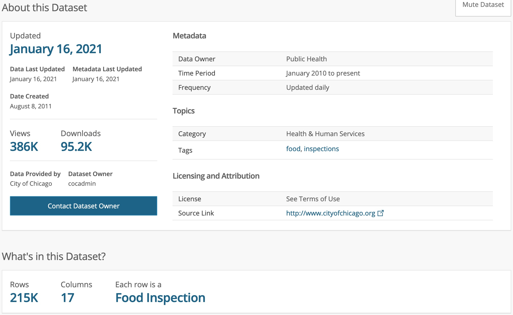

<sup><sub>**NOTA**: *Screenshot* tomado el sábado 16 de enero de 2021, por lo que el número de observaciones de la base de datos probablemente ya sea mayor.</sup></sub>

- La información se obtiene de las inspecciones de restaurantes y otros establecimientos de comida en *Chicago* desde el 01/01/2010.

- Las inspecciones se realizan por personal del Chicago Department of Public Health’s Food Protection Program siguiendo un procedimiento estandarizado.

### *Summary* de los datos  :checkered_flag: 


### ¿Qué buscamos contestar con nuestro modelo? 🧐


### Tomar en cuenta :point_left:


##

[Volver a 'Tabla de Contenido'](https://github.com/jlrzarcor/ITAM-dpa2021/blob/main/README.md#tabla-de-contenido--floppy_disk) 💾 🔘

---

## ¿Cómo está dividido nuestro proyecto?   :date: :pushpin:


- :white_check_mark:  *Checkpoint* 1:  *Starting point*.

<sup><sub>**NOTA**: Para el *checkpoint* 1, los datos los descargamos el sábado 16 de enero.</sup></sub>

- :white_check_mark:  *Checkpoint* 2:  Ingestión y almacenamiento.
- :white_check_mark:  *Checkpoint* 3:  Pre-procesamiento y limpieza.
- 🔵 :soon:  *Checkpoint* 4:  *Feature engineering*.
- :yellow_circle:  *Checkpoint* 5:  Entrenamiento.
- :red_circle:  *Checkpoint* 6:  *Bias & Fairness*.
- :red_circle:  *Checkpoint* 7:  Predicción.
- :red_circle:  *Checkpoint* 8:  Interpretabilidad.
- :red_circle:  *Checkpoint* 9:  *API*. 
- :red_circle:  *Checkpoint* 10: *Dashboard*.

##

[Volver a 'Tabla de Contenido'](https://github.com/jlrzarcor/ITAM-dpa2021/blob/main/README.md#tabla-de-contenido--floppy_disk) 💾 🔘

---

## ¿Qué lenguaje utlizamos? :pen:


[***Python.org***](https://www.python.org/)


##

[Volver a 'Tabla de Contenido'](https://github.com/jlrzarcor/ITAM-dpa2021/blob/main/README.md#tabla-de-contenido--floppy_disk) 💾 🔘

---

## ¿Qué *IDE* utlizamos? 🪐 📓

[***Jupyter.org***](https://jupyter.org/)

[***Jupyter Notebook's GitHub page***](https://github.com/jupyter/notebook)

<p align = "left">
    
    
##

[Volver a 'Tabla de Contenido'](https://github.com/jlrzarcor/ITAM-dpa2021/blob/main/README.md#tabla-de-contenido--floppy_disk) 💾 🔘

---

## Estructura básica del proyecto  :file_folder:

```
├── README.md          <- The top-level README for developers using this project.
│
├── conf
│   ├── base           <- Space for shared configurations like parameters.
│   └── local          <- Space for local configurations, usually credentials.
│
├── docs               <- Space for Sphinx documentation.
│
├── notebooks          <- Jupyter notebooks.
│   ├── eda
│   └── feature_engineering
│
├── images             <- Contains images used in the repository.
│
├── references         <- Data dictionaries, manuals, and all other explanatory materials.
│
├── results            <- Intermediate analysis as HTML, PDF, LaTeX, etc.
│
├── requirements.txt   <- The requirements file.
│
├── .gitignore         <- Avoids uploading data, credentials, outputs, system files etc.
│
├── infrastructure
│
├── sql
│
├── setup.py
│
└── src                <- Source code for use in this project.
    │
    ├── __init__.py    <- Makes src a Python module.
    │
    │
    ├── utils      <- Functions used across the project.
    │   ├── constants.py
    |   └── general.py 
    │
    ├── etl       <- Scripts to transform data from raw to intermediate.
    │   ├── task_almacenamiento.py
    |   └── task_ingesta.py 
    │
    ├── pipeline  <- Functions used for the pipeline.
    |   └── ingesta_almacenamiento.py 
```

##

[Volver a 'Tabla de Contenido'](https://github.com/jlrzarcor/ITAM-dpa2021/blob/main/README.md#tabla-de-contenido--floppy_disk) 💾 🔘

---

## Sobre nuestro ***EDA***   🔵 🟡 :red_circle: 🟢 🟠

<p align = "left">
    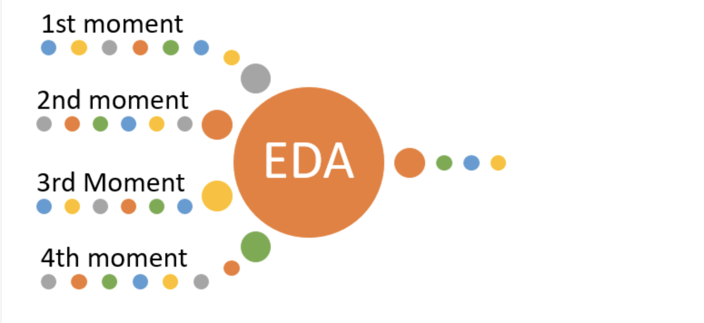

- En la ruta `notebooks/eda/EDA_GEDA_Checkpoint1.ipynb` encontrarás el *notebook* que contiene los resultados encontrados en el ***checkpoint 1*** del proyecto.

```
├── notebooks
    │
    ├── eda
    │   ├── EDA_GEDA_Checkpoint1.ipynb <- Notebook used for Checkpoint 1
    │   ├── chicomm.dbf
    │   ├── chicomm.prj
    │   ├── chicomm.shp
    │   ├── chicomm.shx
    |   └── itam_logo.png
    │
    │
    ├── feature_engineering 
    │
```

- En la ruta `notebooks/eda/Food_Inspections.csv` deberá ser el archivo que descargaste de la liga mencionada anteriormente para poder utilizarse con el *notebook* de nuestro *EDA*.

##

### ¿Cómo reproducir los resultados del *EDA*?  :computer:

Si usted desea reproducir el *notebook* del *EDA*, lo que tiene que hacer es lo siguiente:

1. Clonar el repositorio en la dirección de su agrado dentro de su computadora con el comando:
 
`git clone <url del repositorio> <nombre que desea poner al repositorio dentro de su sistema>`.


2. Descargar el csv de esta [url](https://data.cityofchicago.org/Health-Human-Services/Food-Inspections/4ijn-s7e5) y colocarlo en la ruta: `/notebooks/eda`.

3. **Opcional, requiere pyenv:** Genera el ambiente virtual para este proyecto con el comando:

`pyenv virtualenv 3.7.4 nombre_de_tu_environment`.

  Activa el ambiente virtual con el siguiente comando: `pyenv activate nombre_de_tu_environment`

  --> instalar ipykernel<br>
  `pip install ipykernel`

  --> hacer accesible el ambiente virtual al notebook de jupyter<br>
  `python -m ipykernel install --user --name nombre_de_tu_environment --display-name nombre_de_tu_environment`
  


4. Instalar el `requirements.txt` que se encuentra en el mismo directorio de este archivo `README.md` con el comando:

`pip install -r requirements.txt`.

5. Abre tu terminal y desde ella entra al directorio raíz de este archivo.

6. Corre el comando `jupyter notebook` (asegúrate de tener activo tu environment).

7. Abre el archivo `EDA_GEDA_Checkpoint1.ipynb` y ya podrás operarlo sin problemas.

##

[Volver a 'Tabla de Contenido'](https://github.com/jlrzarcor/ITAM-dpa2021/blob/main/README.md#tabla-de-contenido--floppy_disk) 💾 🔘

---

## ¿Cómo funciona nuestro proceso de ingestión? :fork_and_knife:

<p align = "left">
    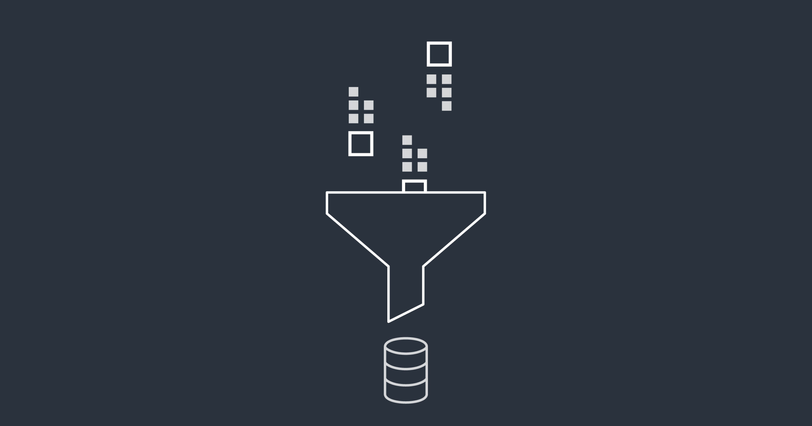


El proceso **consiste** en descargar la información de inspecciones que está contenida en la página [***Chicago Food Inspections***](https://data.cityofchicago.org/Health-Human-Services/Food-Inspections/4ijn-s7e5) de **forma programática y automatizada**. Se realiza una **ingesta inicial (descarga)** y posteriormente se realizarán **descargas semanales consecutivas**.


En los **módulos** siguientes se integran las funciones que nos permitirán realizar todo el proceso:

`general.py` e `ingesta_almacenamiento.py`.

 :open_file_folder: Se encuentran ubicadas en la rama `main` dentro de la carpeta `src` de la siguiente manera:

```
├── src
    │
    ├── __init__.py
    │
    │
    ├── utils
    |   └── general.py    
    │
    │
    ├── etl
    │
    │
    ├── pipeline
    |   └── ingesta_almacenamiento.py    
```

Una vez que se ha realizado la ingesta inicial como la consecutiva, la información será transformada en un archivo compacto (formato *pickle*, `.pkl`) para posteriormente ser almacenada en la nube de [***AWS S3***](https://aws.amazon.com/s3/). De esta forma, **mantendremos nuestro producto de datos actualizado**.


1.	Para realizar la ingestión de información de ***Chicago Food Inspections*** es necesario que el usuario se dé de alta [aquí](https://data.cityofchicago.org/login) y genere un `app token`.

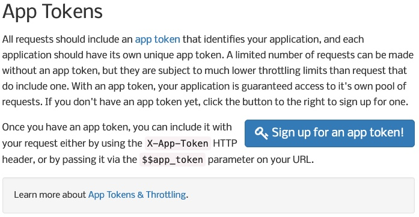

2.	Contar con una cuenta activa de ***AWS***. En ésta, se debe tener un *bucket* de ***S3*** exclusivo para almacenar la información del proyecto; **importante** mencionar que se debe conocer el **nombre exacto** del *bucket* y contar con el ***Access Key ID***.

<p align = "left">
    

3.	Debe crear un archivo `credentials.yaml` siguiendo la siguiente estructura: 

```
---
s3:
    aws_access_key_id: "de_tu_cuenta_de_AWS"
    aws_secret_access_key: "de_tu_cuenta_de_AWS"
food_inspections:
    api_token: "de_tu app_token_del_prerrquisito_1"
```

4.	Contar con un ambiente virtual de `pyenv` y tenerlo activo. Una vez posicionado dentro de éste, debe definir su variable de entorno `PYTHONPATH`. Debe abrir su terminal y posicionarse en la raíz del repositorio y ejecutar el comando `export PYTHONPATH=$PWD`.

5.	Para poder generar las conexiones necesarias con los clientes, debe crear la carpeta `conf/local` donde deberá colocar su archivo `credentials.yaml` (del prerrequisito 3). 


Para iniciar con el **proceso de ingesta/almacenamiento** debe colocarse en la **raíz** de su **repostorio clonado** y seguir los siguientes **macroprocesos**:


- Estableceremos una **conexión** tipo "**cliente**" con la *API* del *Chicago Portal* llamando a nuestra función `get_client` (que se encuentra dentro de `ingesta_almacenamiento.py`), utilizando la **clase Socrata** de ***SODAPY***). Ésta a su vez llamará a la función `get_api_token` (que se encuentra dentro de `general.py`) la cual leerá  el *token* desde el archivo `credentials.yaml` (descrito en `prerrequisitos`). Se retorna un cliente que podemos asignar a una variable `client`.

- Análogamente, establecemos una conexión con *AWS* en el servicio de *S3* del tipo `resource service client by name` llamando a nuestra función `get_s3_credentials()` (que se encuentra dentro de `ingesta_almacenamiento.py`), que a su vez llamará a la función `get_S3_credentials` (que se encuentra dentro de `general.py`) la cual leerá  el *token* desde el archivo `credentials.yaml` y retorna las credenciales necesarias para establecer la conexión (se utiliza la clase ***Session*** de ***Boto3***). Se retorna un cliente que podemos asignar a una variable "***S3***".


**Inicial**:

- Se realiza sólo una vez y consiste en descargar toda la información generada hasta cierta fecha específica que sea lo más actual posible, considerando que la actualización de los datos se realiza en el portal los lunes a las 6:00 a.m.

- Solicitamos una descarga con la función `ingesta_inicial(client, limit)`, la cual recibe la variable "***client***" (definida en el macropoceso 1) y la variable "***limit***" (que define el número de registros a ingestar; se recomienda utilizar como **cota superior 300,000** para garantizar que se ingesta la totalidad de registros a la fecha específica).

- Retorna un objeto `list` con los registros generados en la consulta que pueden ser asignados a la variable `data_ii`.

**Consecutiva**:

- Se realizará de **forma automátizada cada semana posterior a la actualización del portal**. Actualmente el proceso de automatización está en desarrollo, por lo que sólo se puede realizar un *test* llamando a la función).

- Solicitamos una descarga con la función `ingesta_consecutiva(client, date, limit)`:
    - `client`: definida en el macroproceso 1.
    - `date`: *timestamp (string)* con el siguiente formato '**AAAA-MM-DDT00:00:000**'. Se debe respetar las comillas simples. Donde "AAAA" 4 dígitos del año, "MM" 2 dígitos del mes y "DD" 2 dígitos del día; "T" es un separador para el horario. Por último se deben conservar los dígitos en 0.
    - `limit`: *numeric* que define el número de registros a ingestar (se recomienda utilizar como **cota superior 1,000** para garantizar la totalidad del diferencial o "*delta* de registros").

- Retorna un objeto `list` con los registros generados en la consulta que pueden ser asignados a la variable `data_ic`.

**NOTA**: Las funciones anteriores invocan a la función `client.get()` de la clase **Socrata** de ***SODAPY***, la cual requiere los parámetros indicados en [***Access Dataset via SODA API***](https://data.cityofchicago.org/Health-Human-Services/Food-Inspections/4ijn-s7e5):

- `socrata_domain` = "data.cityofchicago.org"
 
- `socrata_ds_id` = "4ijn-s7e5"
    
- Por último, estos se cargan de forma automática, no se requiere indicarlos.

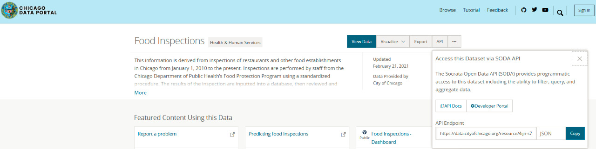


Una vez que se ha realizado la **ingesta**, los datos generados en el proceso anterior serán transformados en un archivo con formato `pickle` o `.pkl` y serán almacenados en su *bucket* de *S3* de *AWS* con el nombre `historic-inspections-AAAA-MM-DD` o `consecutive-inspections-AAAA-MM-DD` según sea el caso, integrándolos en las subcarpetas denominadas `initial` y `consecutive` que están en una carpeta que se denmominará `ingestion` (mencionamos que no es necesaria tal estructura en el *bucket*, en automático se crea si no existe).

Para lo anterior, utilizaremos nuestra función `guardar_ingesta(my_bucket, bucket_path, data)` que recibe las variables:
   - `my_bucket`: *string* con el nombre de su *bucket* de *S3*.
   - `bucket_path`: *string* con alguno de los siguientes valores `ingestion/initial` o `ingestion/consecutive` según sea la ingesta a almacenar. Para estos valores, hemos realizado una declaración previa en las variables de ambiente `constants.py`, como `key1` y `key2` respectivamente.
   - `data`: recibe el objeto `list` generado en el macroproceso 2. Si se declararon las variables `data_ii` o `data_ic`, debe utilizarlas en lugar de declarar la variable `data`.
 
 
 
1. Posicionarse en la carpeta donde se hizo el clon del repositorio.
2. Activar el entorno `pyenv` adecuado y exportar la variable de entorno `PYTHONPATH` (mencionado arriba).
3. Ejecutar el comando `python`.
4. Dentro de la terminal de python (>>>) ejecutar los siguientes comandos:
```
# Declaración de módulos.
>>> import src.utils.constants as ks
>>> import src.utils.general as gral
>>> import src.pipeline.ingesta_almacenamiento as ial

# Declaración de variables auxiliares.
>>> date = '2020-02-18T00:00:000'  # Ejemplo con declaración de variable date de acuerdo a lo mencionado en el Macroproceso 2.
>>> my_bucket = "bucket_del_equipo_rocket"  # Ejemplo de declaración de la variable my_bucket de acuerdo a lo indicado en el Macroproceso 3.

# Desarrollo de funciones.
>>> client = ial.get_client()
>>> data_ii = ial.ingesta_inicial(client, limit = 300000)
>>> data_ic = ial.ingesta_consecutiva(client, date , limit=1000)
>>> ial.guardar_ingesta(my_bucket, ks.key1, data_ii) # Para la ingesta inicial.
>>> ial.guardar_ingesta(my_bucket, ks.key2, data_ic) # Para la ingesta consecutiva.
```


Al mandar llamar la librería `import src.utils.constants as ks`, se mandan llamar también las siguientes variables de entorno que son utilizadas para realizar la ingesta:

 - `socrata_domain` = "data.cityofchicago.org"
 
 - `socrata_ds_id` = "4ijn-s7e5"
 
 - `path` = os.path.realpath('conf/local/credentials.yaml')
 
 - `key1` = 'ingestion/initial'
 
 - `key2` = 'ingestion/consecutive'

<sub><sup>**NOTA**: A partir del ***Checkpoint*** **3** la función 'guardar_ingesta' queda *deprecated*. Debido a que se encuentra contenida en el *pipeline* de *Luigi*.</sup></sub>

##

[Volver a 'Tabla de Contenido'](https://github.com/jlrzarcor/ITAM-dpa2021/blob/main/README.md#tabla-de-contenido--floppy_disk) 💾 🔘

---

## Sobre nuestro *Data Pipeline*  :microscope:

<p align = "left">
    
    
Nuestro proyecto está conformado por diferentes *pipelines*. Para ordenar la secuencia que éstos deben seguir, utilizamos un orquestador llamado [***Luigi***](https://luigi.readthedocs.io/en/stable/).


[***Luigi's documentation***](https://luigi.readthedocs.io/en/stable/)

[***Luigi's GitHub page***](https://github.com/spotify/luigi)


### ¿Qué es *Luigi*?

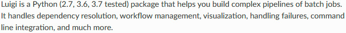

<sub><sup>**Fuente**:[***Luigi's documentation***](https://luigi.readthedocs.io/en/stable/)</sup></sub>

Este orquestador es la herramienta que nos permite correr nuestro *data pipeline*, definiendo aspectos importantes del cómo, cúando y con qué se debe correr cada proceso.

Para administrar el orden de las tareas (cómo nuestros distintos *tasks* correrán) en el *pipeline*, ***Luigi*** utiliza una estructura de datos llamada ***DAG*** (***Directed Acyclic Graph***). Es una herramienta visual útil y que ilustra de manera clara los procesos que nuestro proyecto sigue.

##


- Se permite tener más de 1 entrada y sólo 1 salida al final del proceso. **NO** se permite tener ciclos.

- Está conformado por:

 Cada nodo representa el *task* a ejecutar.

 Cada arista la dirección de flujo.

- Sigue 3 principios:

 Aunque un proceso se corra con los mismos parámetros en múltiples ocasiones, la salida que se obtiene siempre será la misma. Esto implica que tampoco se generan salidas repetidas.

 La dirección del grafo va en un sólo sentido.

 La salida de un nodo no puede regresar a uno que ya fue procesado.

##


***Luigi*** tiene 2 objetos principales para construir su ***DAG***:

 Dónde se sacan los datos que requiere un *task*.

 La tarea que queremos sea administrada.

Para declarar un *task* en *Luigi* debemos tener un *script* que tenga los siguientes 4 métodos requeridos:

- `run()` : El código que se debe correr.

- `input()` : Qué requiere de entrada la tarea y de dónde se debe obtener.

- `output()` : Qué salida genera la tarea y dónde se queda persistida o guardada. Éste siempre regresa un objeto de tipo `target`.

- `requires()` : Método con el que se define cómo está formado el grafo de dependencias entre tareas.

<sub><sup>**NOTA**: Estos métodos son opcionales, excepto 'run()'.</sup></sub>

##

En los **módulos** siguientes se integran las funciones que nos permitirán realizar todo el proceso de *tasks* y *tasks* de *metadata*:

, , , , , ,  y .

 :open_file_folder: Se encuentran ubicadas en la rama `main` dentro de la carpeta `src` de la siguiente manera:

```
├── src
    │
    ├── __init__.py
    │
    │
    ├── utils    
    │
    │
    ├── etl
    │   ├── task_almacenamiento.py
    │   ├── task_ingesta.py 
    │   ├── task_limpieza.py
    │   ├── task_feature_engineering.py
    │   ├── task_feature_engineering_metadata.py
    │   ├── task_limpieza_metadata.py
    │   ├── task_almacenamiento_metadata.py
    |   └── task_ingestion_metadata.py
    │
    │
    ├── pipeline
    │
```

##

**Y así se ve el** ***DAG*** **de nuestro** ***data pipeline*** **orquestado en** ***Luigi***:

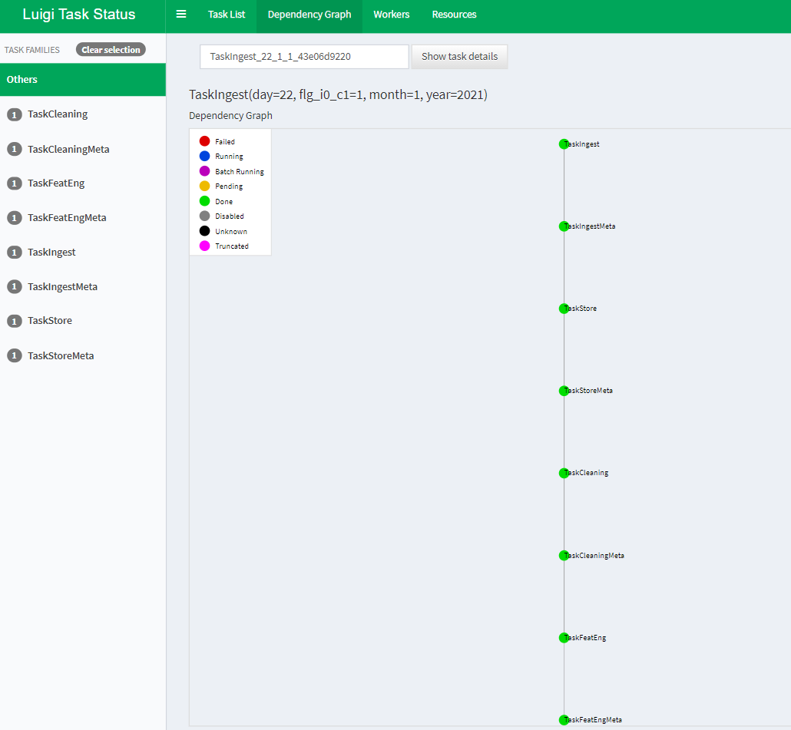

<sup><sub>**NOTA 1**: El color verde indica que los *tasks* corrieron de manera exitosa.</sup></sub>

<sup><sub>**NOTA 2**: Ver ["¿Cómo ejecutar nuestro *pipeline*?"](https://github.com/jlrzarcor/ITAM-dpa2021#c%C3%B3mo-ejecutar-nuestro-pipeline-%EF%B8%8F-) para poder ejecutar nuestros *tasks*.</sup></sub>

##

[Volver a 'Tabla de Contenido'](https://github.com/jlrzarcor/ITAM-dpa2021/blob/main/README.md#tabla-de-contenido--floppy_disk) 💾 🔘

---

## Sobre nuestro *Feature Engineering*  :hammer:

<p align = "left">
    
    
- En la ruta `notebooks/feature_engineering/Feature_Engineering_Checkpoint4.ipynb` encontrarás el *notebook* que contiene los resultados encontrados en el ***checkpoint 4*** del proyecto.

```
├── notebooks
    │
    ├── eda
    │
    │
    ├── feature_engineering
    │   ├── Feature_Engineering_Checkpoint4.ipynb <- Notebook used for Feature Engineering; Checkpoint 4
    |   └── itam_logo.png
    │
```

##

### ¿Cómo reproducir los resultados del *Feature Engineering*?  :computer:

Si usted desea reproducir el *notebook* de *Feature Engineering*, lo que tiene que hacer es lo siguiente:

1. Clonar el repositorio en la dirección de su agrado dentro de su computadora con el comando:
 
`git clone <url del repositorio> <nombre que desea poner al repositorio dentro de su sistema>`.


2. Descargar el csv de esta [url](https://data.cityofchicago.org/Health-Human-Services/Food-Inspections/4ijn-s7e5) y colocarlo en la ruta: `/notebooks/feature_engineering`.

3. **Opcional, requiere pyenv:** Genera el ambiente virtual para este proyecto con el comando:

`pyenv virtualenv 3.7.4 nombre_de_tu_environment`.

  Activa el ambiente virtual con el siguiente comando: `pyenv activate nombre_de_tu_environment`

  --> instalar ipykernel<br>
  `pip install ipykernel`

  --> hacer accesible el ambiente virtual al notebook de jupyter<br>
  `python -m ipykernel install --user --name nombre_de_tu_environment --display-name nombre_de_tu_environment`
  


4. Instalar el `requirements.txt` que se encuentra en el mismo directorio de este archivo `README.md` con el comando:

`pip install -r requirements.txt`.

5. Abre tu terminal y desde ella entra al directorio raíz de este archivo.

6. Corre el comando `jupyter notebook` (asegúrate de tener activo tu environment).

7. Abre el archivo `Feature_Engineering_Checkpoint4.ipynb` y ya podrás operarlo sin problemas.

##

[Volver a 'Tabla de Contenido'](https://github.com/jlrzarcor/ITAM-dpa2021/blob/main/README.md#tabla-de-contenido--floppy_disk) 💾 🔘

---

## *Data Governance*  :round_pushpin:  :ledger:

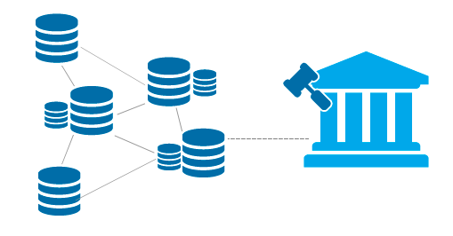

Tiene la función de diseñar y garantizar los estándares que asuguren el flujo de información constante y calidad a través de los sistemas y fuentes de la empresa.

El Gobierno de Datos conforma una unidad que funciona de forma coordinada para aumentar la eficiencia en el uso y gestión de la información.

Se ocupa de:

- Cumplir los objetivos relacionados con los datos de la empresa.

- Gestión y administración de los datos como un activo estratégico de la organización.

- Cumplimiento eficiente a reducir costos.

- Planificar, establecer procesos, desarrollos y supervisar la gestión de datos para un uso óptimo.

- Encontrar la tecnología adecuada para cubrir las distintas necesidades.

##

En este paso incorporamos dos actividades más:  y , así como guardar la *metadata* de cada uno de los *tasks* en *RDS*. 

La manera en que que estructuramos nuestros *tasks* es la siguiente:

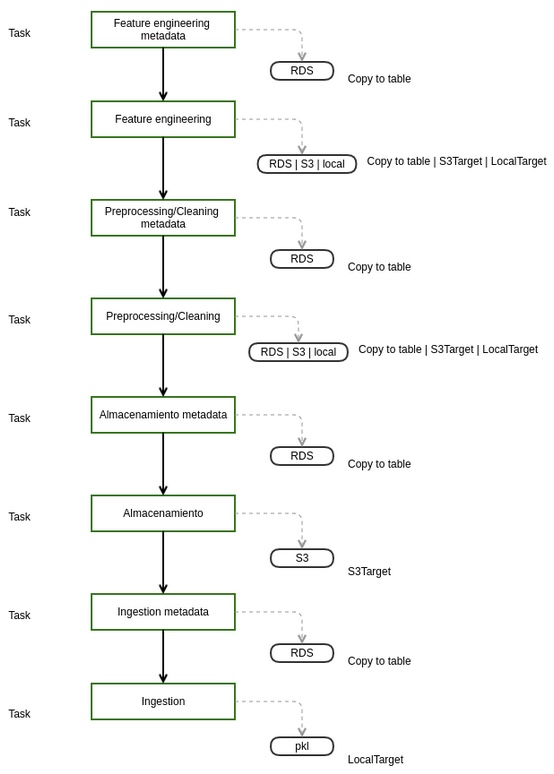

##

### Infraestructura *AWS*

Para ello, se requiere configurar en *AWS* una infraestructura como la mostrada en la imagen siguiente:

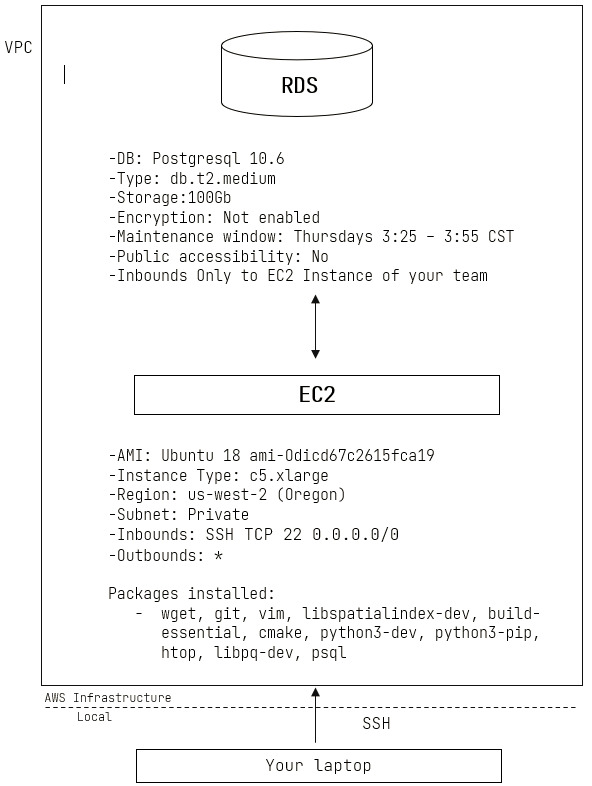

<sup><sub>**NOTA**: La configuración de cada instancia, así como de la *RDS* queda fuera del alcance de este *README*.</sup></sub>

##


Debido a que ahora utilizaremos *RDS* para almacenar tablas de los metadatos generados en cada *Task*, debemos contar con credenciales que nos permitan entrar a ésta. 

### Actualización archivo *credentials.yaml*

El archivo `credentials.yaml` debe actualizarse para contener la siguiente estructura:

```
---
s3:
    aws_access_key_id: "de_tu_cuenta_de_AWS"
    aws_secret_access_key: "de_tu_cuenta_de_AWS"
food_inspections:
    api_token: "de_tu app_token_del_chicago_data_portal"
pg_service:
    user: "tu_postgres_user"
    password: "tu_postgres_user_password"
    host: "direccion_de_tu_RDS.us-west-2.rds.amazonaws.com"
    port: 5432
    dbname: "nombre_base_datos" 
```

##

[Volver a 'Tabla de Contenido'](https://github.com/jlrzarcor/ITAM-dpa2021/blob/main/README.md#tabla-de-contenido--floppy_disk) 💾 🔘

---

## ¿Cómo ejecutar nuestro *pipeline*? ⚒️ 🚀 


- Tener creada la [Infraestructura de *AWS*](https://github.com/jlrzarcor/ITAM-dpa2021/blob/main/README.md#infraestructura-aws).

- Actualizar el [archivo *credentials.yaml*](https://github.com/jlrzarcor/ITAM-dpa2021/blob/main/README.md#actualizaci%C3%B3n-archivo-credentialsyaml) con las claves adecuadas.

- Crear el archivo de configuración `.pg_service.conf` para el servicio *Postgres*:

```
[alias_servicio]
user=user_rol_postgres
password=password_user_rol
host=end_point_user_RDS
port=5432
dbname=chicagofoodinsp
```

<sup><sub>**NOTA**: *'alias_ servicio'* es el identificador de las credenciales especificadas de servicio.</sup></sub>

El cual se debe colocar en el directorio raíz de la instancia *EC*2:

```
> Directorio del archivo en sistema: ~/.pg_service.conf
```

##

 

1. Tener en ejecución la [Infraestructura de *AWS*](https://github.com/jlrzarcor/ITAM-dpa2021/blob/main/README.md#infraestructura-aws).

2. Abrir su terminal, posicionarse en la carpeta `/home/.ssh` y correr:

```
ssh -i nombre_llave_.pem su_usuario@ec2-direccion-de-la-EC2.us-west-2.compute.amazonaws.com
``` 

para conectarse a la instancia *EC2* (*i.e.* su bastión).

3. Clonar el repositorio del proyecto: 

`git clone <url del repositorio> <nombre que desea poner al repositorio dentro de su sistema>`.

4. Instalar '*pyenv*' en el bastión y crear un ambiente virtual llamado 'itam_dpa' que tenga : 

`pyenv install 3.7.4`.

5. Instalar '*pip*': `sudo apt install python3-pip`. Asegurarse que el usuario tiene privilegios de *sudo* (*super user*).

6. Instalar nuestro *requirements.txt*: `pip install -r requirements.txt`. 

7. Posicionarse en la carpeta del repositorio clonado en el paso 3.

8. Activar su ambiente virtual: `pyenv activate itam_dpa`.

9. De ser necesario actualizar el repositorio clonado: `git pull`.

<sub><sup>**NOTA**: Del paso 2 al paso 9, fueron indicados previamente en el README, sin embargo, se vuelven a mencionar en caso de que alguien los necesite de nuevo.</sup></sub>

10. Declar las variables de entorno con los comandos:

```
export PGSERVICEFILE=${HOME}/.pg_service.conf
export PGSERVICE=nombre_de_tu_service
export PYTHONPATH=$PWD
```

11. De igual manera, es necesario crear la infraestructura de tablas en `psql` para almacenar la metadata. Para lo anterior, debe tener acceso a la *RDS* como usuario `postgres`. Posicionarse en la carpeta `/sql` y correr los siguientes 3 comandos:

```
psql -f create_db.sql
psql -f create_schemas.sql
psql -f create_metadata_tables.sql
psql -f create_procdata_tables.sql
```

12. En este punto ya se ejecutan los *tasks* de *Luigi*; iniciando por el último: 

```
PYTHONPATH="." luigi --module 'src.etl.task_feature_engineering_metadata' TaskFeatEngMeta --local-scheduler --bucket nombre_de_su_bucketS3 --prc-path ingestion --year año_deseado --month mes_deseado --day día_deseado --flg-i0-c1 0_ó_1
```

Tomar en cuenta:

- Tanto los meses como los días, no llevan un cero antes.

- Después del *flag* se puede escribir 0 (ingesta inicial) ó 1 (ingesta consecutiva).

- `prc-path` es la ruta de la subcarpeta que almacena el proceso. Por *default* nosotros lo llamamos `ingestion`.

*e.g.* Si queremos hacer la **ingesta inicial** del 5 de marzo de 2020 debemos correr:

```
PYTHONPATH="." luigi --module 'src.etl.task_feature_engineering_metadata' TaskFeatEngMeta --local-scheduler --bucket nombre_de_su_bucketS3 --prc-path ingestion --year 2020 --month 3 --day 5 --flg-i0-c1 0
```

Si el *task* corrió de manera exitosa, el siguiente mensaje es desplegado:

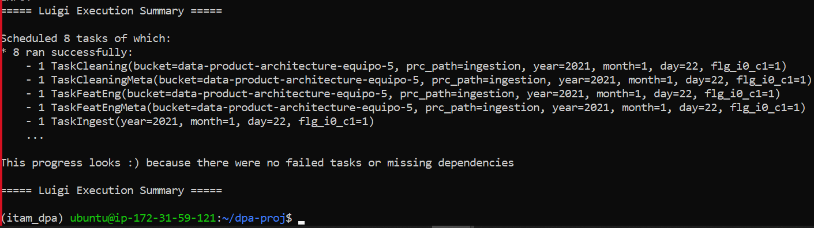

<sub><sup>**NOTA**: Hasta aquí se considera el *checkpoint* 4.</sup></sub>

##

[Volver a 'Tabla de Contenido'](https://github.com/jlrzarcor/ITAM-dpa2021/blob/main/README.md#tabla-de-contenido--floppy_disk) 💾 🔘

---
